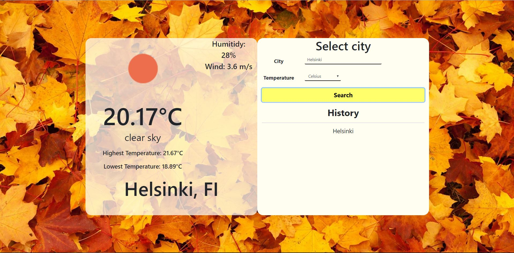
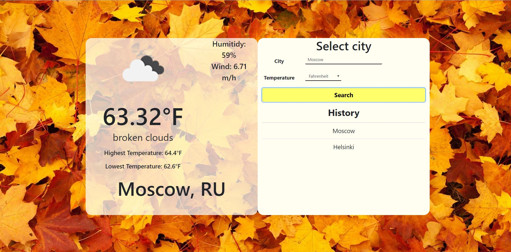

### React project with openweathermap
Small project with openweathermap api key and also trying to learn React Redux.
In website you can search current date weather by writing city in the input text box and you need select temp to submit search.
In History table it will save last 5 searched city and when it reach five citys then it will remove last from the list and add new to the top. Also when u click city from history it will set data to the input fields.

### Screenshot 1.

### Screenshot 2.

### other links 
Web background picture [link](https://pixabay.com/fi/photos/syksy-tausta-v%C3%A4ri-lehdet-kulta-83761/)
